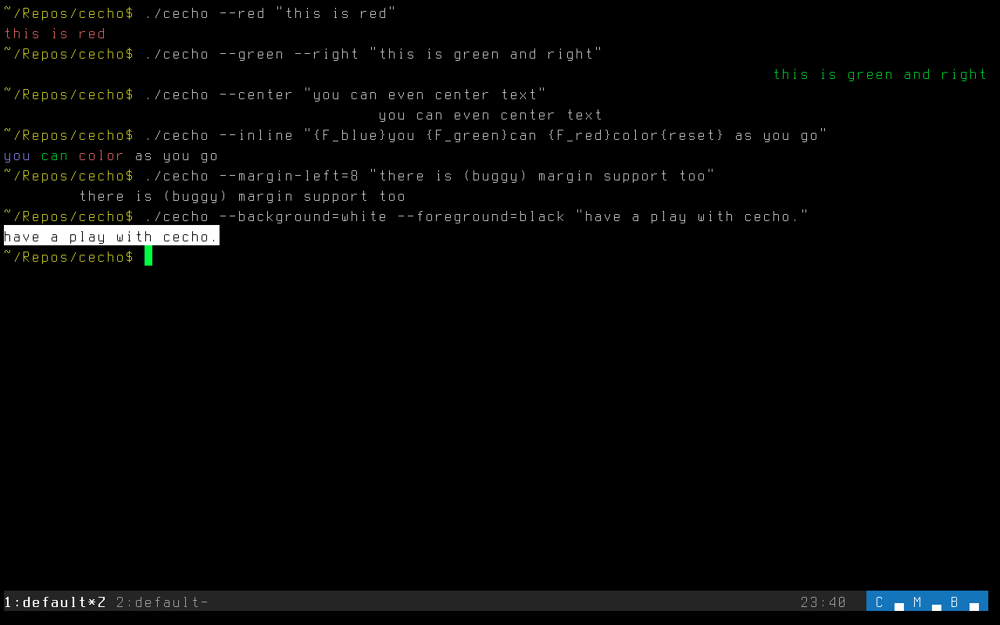

# cecho

### Description
Just like echo but colourful, formatted and stylish.

### Requirements
It should run on any Unix OS. If you notice any problems let me know.

### Usage
`cecho [OPTIONS] [string ...]"`

### Options

| Option          |  Function                                                 |
| --------------- | --------------------------------------------------------- |
| -n              |  Do not output the trailing newline.                      |
| --centre        |  Centre the text in the terminal.                         |
| --right         |  Align the text to the right side of terminal.            |
| --doublespace   |  Add spaces between each of the letters                   |
|                 |                                                           |
| --margin        | Set the width of the left and right margins.              |
| --margin-left   | Set the width of the left margin.                         |
| --margin-right  | Set the width of the right margin.                        |
|                 |                                                           |
| --show-colours  |  Show available colours.                                  |
| --background    |  Set the background colour.                               |
| --foreground    |  Set the background colour.                               |
|                 |                                                           |
| --black         |  Shorthand for setting foreground to black.               |
| --blue          |  Shorthand for setting foreground to blue.                |
| --cyan          |  Shorthand for setting foreground to cyan.                |
| --dark-blue     |  Shorthand for setting foreground to dark-blue.           |
| --dark-gray     |  Shorthand for setting foreground to dark-gray.           |
| --dark-green    |  Shorthand for setting foreground to dark-green.          |
| --dark-grey     |  Shorthand for setting foreground to dark-grey.           |
| --green         |  Shorthand for setting foreground to green.               |
| --grey          |  Shorthand for setting foreground to grey.                |
| --light-blue    |  Shorthand for setting foreground to light-blue.          |
| --light-cyan    |  Shorthand for setting foreground to light-cyan.          |
| --light-green   |  Shorthand for setting foreground to light-green.         |
| --light-grey    |  Shorthand for setting foreground to light-grey.          |
| --light-magenta |  Shorthand for setting foreground to light-magenta.       |
| --light-red     |  Shorthand for setting foreground to light-red.           |
| --light-yellow  |  Shorthand for setting foreground to light-yellow.        |
| --magenta       |  Shorthand for setting foreground to magenta.             |
| --pink          |  Shorthand for setting foreground to pink.                |
| --red           |  Shorthand for setting foreground to red.                 |
| --white         |  Shorthand for setting foreground to white.               |
| --yellow        |  Shorthand for setting foreground to yellow.              |
|                 |                                                           |
| --help          |  This help.                                               |

### Examples
  Show available colours:  
  `cecho --show-colours`

  Set foreground to red:  
  `cecho --red "string to echo"`

  Set background to blue and foreground to white:  
  `cecho --background=blue --foreground=white "string to echo"`

  Set the background to a specific colour:  
  `cecho --background=170 "string to echo"`

  Set foreground to red and center in terminal.
  `cecho --centre --red "string to echo"`

  Set foreground to green and background to gray for part of a line
  `cecho --inline "{F_green}{B_grey}string to{reset} echo"`
